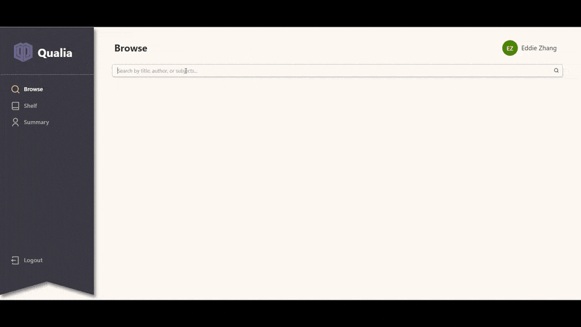
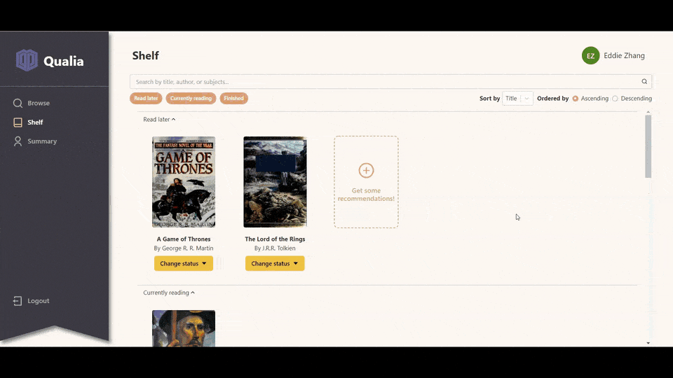
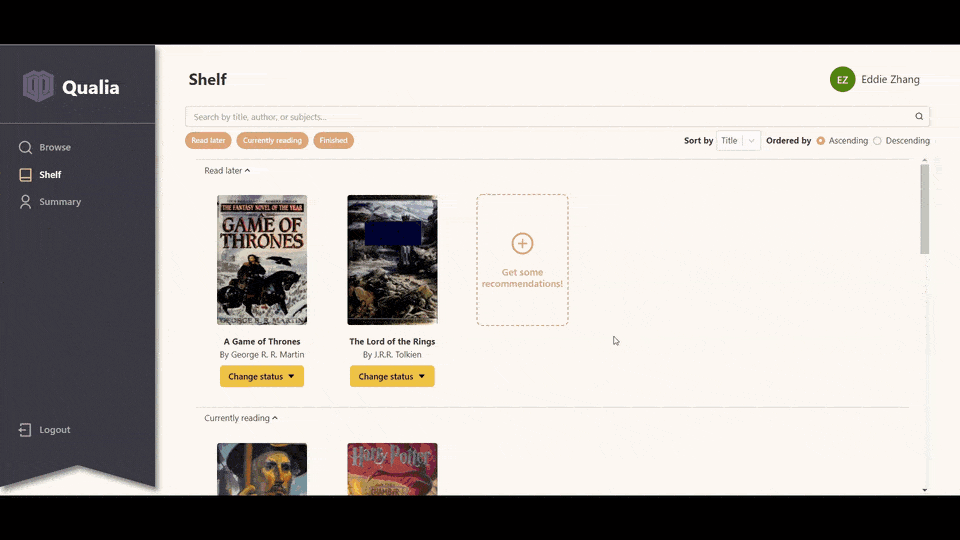
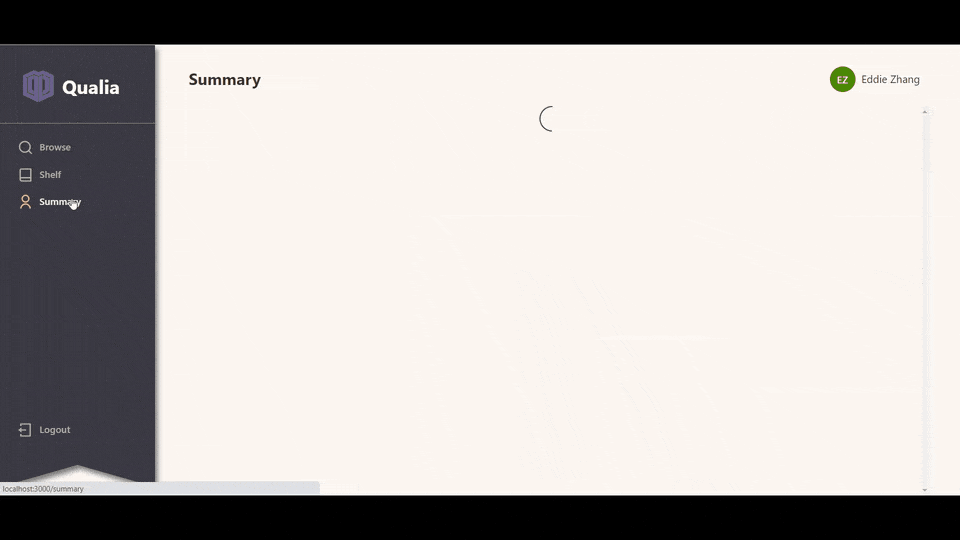

# Qualia

Qualia is your personalized virtual bookshelf. Track the books you read or browse for books to save to your shelf for later. Build up your shelf to get reports on how your tastes evolve over time and get curated recommendations!\
Live at: https://qualia-bookshelf.netlify.app/

## Features

### Browse

Search for books by title, author, or subjects, and mark them as read later, reading, or finished to add them to your shelf

### Shelf

Filter, sort, and search through saved books by status, title, author, and start/end date

### Book suggestions

Generate suggestions from your most-read genres and authors

### User summary

Get statistics about the number of books you read. See the evolution of your tastes visualized over time as well as your all-time favorites

## Acknowledgement

Qualia uses book data from [Open Library's APIs](https://openlibrary.org/developers/api)
